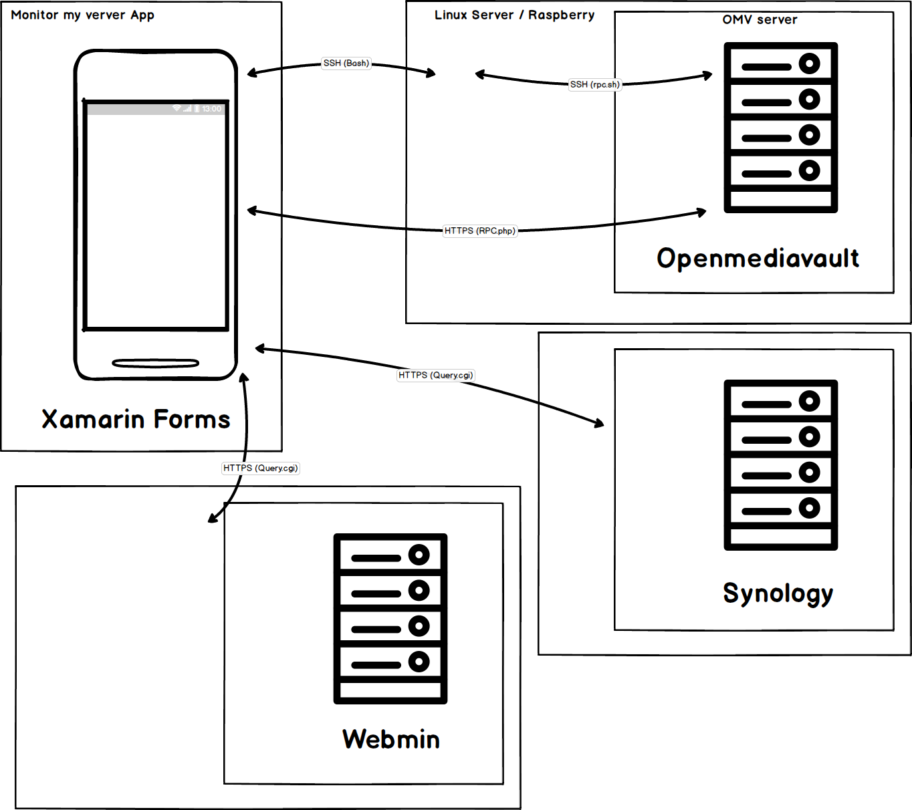

# Doods.Xam.MonitorMyServer 
Monitor my server is a project written in C# (Xamarin.Forms) for android and windows UWP.
First step I want manage Raspberry pi and openmediavault in ssh
For :

  * Check disk space.
  * Show Filesystems (Drives and raid)
  * Show Logs (need to be root sudo or admin with ssh connection).
  * System informations.
  * Updates (need to be root sudo or admin with ssh connection).
  * View running processes
  * Run commands (with ssh connection).
  
You can also use openmediavault rpc page over Http or Ssh.

You can also use Synology cgi.

# Application Diagram

  ## Build Status
  
  | Build Server | Type         | Platform | Status                                                                                                                                                                                 |
|--------------|--------------|----------|----------------------------------------------------------------------------------------------------------------------------------------------------------------------------------------|                                             
| App Center   | Develop   | Android  |  |
| App Center   | Release   | Android      |  |

  ## Get App
  
  * [Android App](https://install.appcenter.ms/users/thibaultherviou/apps/Monitor-my-server-android) via App Center.
  * [Android App](https://play.google.com/store/apps/details?id=com.doods.monitormyserver) via Googel Play.
  * [Android App](https://github.com/doodz/Doods.Xam.MonitorMyServer/releases) via Github Releases.

  ## Question ?
  * [FAQ](https://github.com/doodz/Doods.Xam.MonitorMyServer/wiki/FAQ)
  
  ## Reporting Bugs
  We use [GitHub Issues](https://github.com/doodz/Doods.Xam.MonitorMyServer/issues) to track issues.
  ## Support
  
  If you like the quality and code you can support me  
- 
-   

Thanks!
  
  ## Authors

* **Thibault Herviou** - *Initial work* - [Doods](https://github.com/doodz)

  
